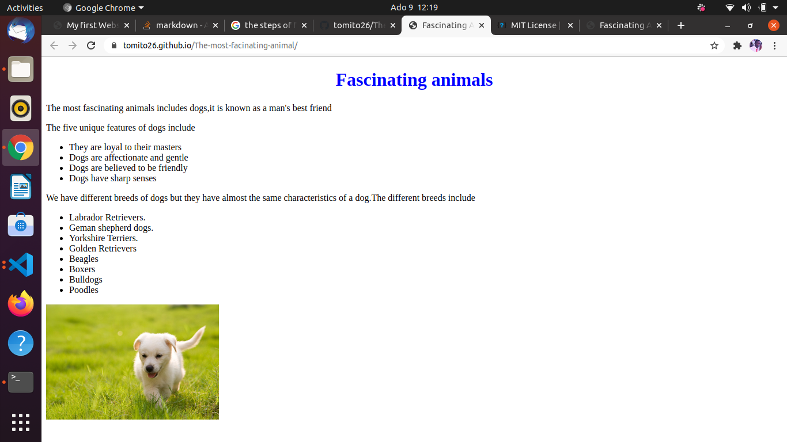

# My Pet
This  project is about my most fascinating animal on the planet at the same time the agenda of the project is to understand the basic structure of the html and CSS


## Author
* Thomas Khaemba

## How to access it
You can clone the repository to your local machine
* Copy the repository [link](https://github.com/tomito26/The-most-facinating-animal.git)
* Go to your terminal and follow the steps below to initiate the cloning
```
$ cd <the directory you want to keep the project>
$ git clone < paste repository link>
$ cd <the clone project folder>
$ code .
```
## How to contribute
You can fork the project then follow the above stepps to clone it to your local machine
## Technologies used
* HTML
* CSS
## License and copyright
Copyright (c) 2020 Thomas Khaemba

Licensed under [MIT License](LICENSE)

